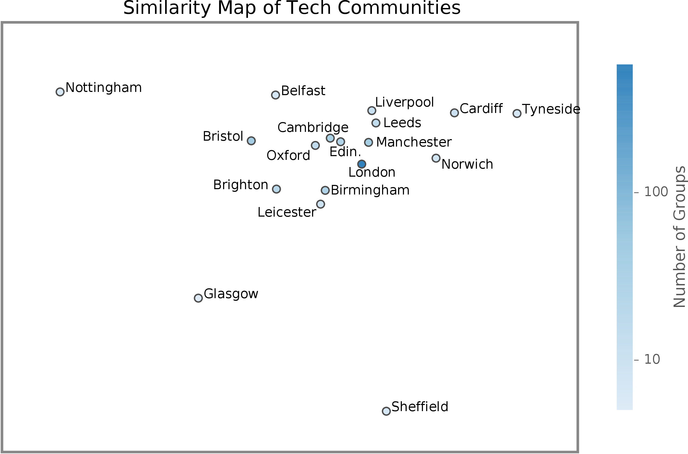
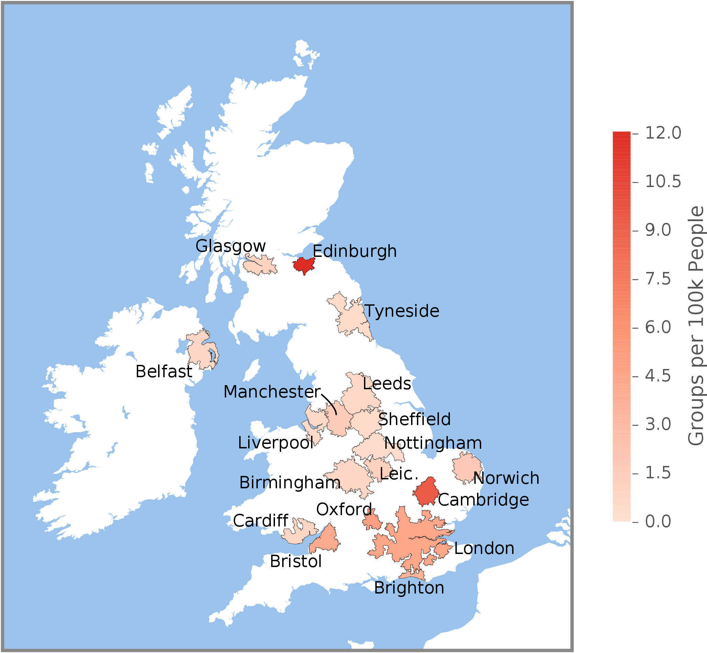
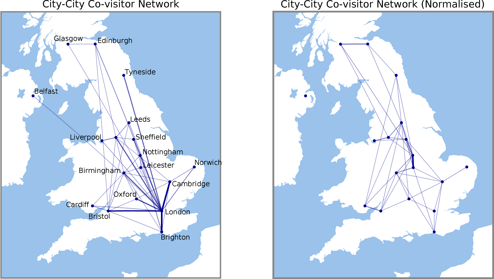
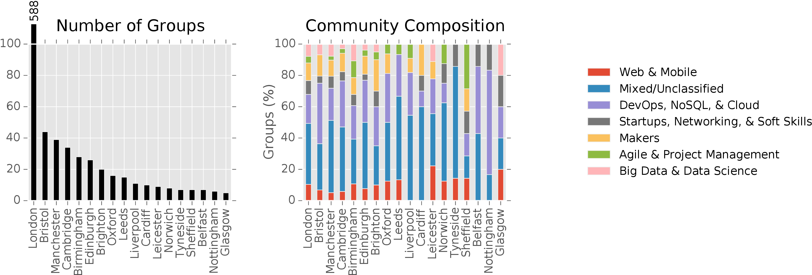

# Introduction

Premise, background (other posts). Data collection.

# Analysis

Findings.

PCA. Many areas have similar profiles: e.g., many places have a web development meetup group. What's more interesting is the other differences.

City-city connectivity. Raw co-visits: London is, unsurprisingly, a hub, simply beacuse it has a large number of groups there. And, good transport access to other locations. As we saw earlier, some cities are much more active than others. In the gravity model, this means they have more mass, and so attract interactions with other cities, especially other cities that also have high mass.

So how about we adjust for the size of the cities? Now we see London dimish. Its remaining significant interactions are with Cambridge and Oxford (the [Golden Triangle](https://en.wikipedia.org/wiki/Golden_triangle_(universities))?), and Brighton (a well-known tech hub). There are many factors that influence how many people visit both cities, including access, transport, and intereset. 
Also, London is full of many people who haven't needed to move to visit another place -- the tech community is on their doorstep. In other cities, one might need to travel further, to a neighbouring hub, (or maybe to london!) to visit.

This gives us an idea of the amount of movement people have to do.

It would be great to extend this analysis with the hometowns of each user. 

Future work:

**Can we match the ecosystem of each UK city with a counterpart in the US?**  
As we've seen, the UK doesn't have a large number of cities for us to compare and contrast, but here are many cities in the US we might compare against. For a particular UK city we could match it with one or more US cities of a similar size and set of interests (e.g., extending group clustering we applied here).

**What drives clusters of cities?** 
For example, in our analysis of integration between cities, we saw that there are places outside of London that have strong connections, such as the Bristol-Cardiff community, and midlands.

# Graphics

# Materials

All scripts and code (including the source Markdown for this blog post) are available at the following Github repository:

[`https://github.com/mattjw/exploring_tech_meetups`](https://github.com/mattjw/exploring_tech_meetups)

# Supplementary Technical Notes

## Crawling

## City/Regional Divisions

There are [many ways](https://theidpblog.files.wordpress.com/2014/08/hierarchical_representation_of_uk_statistical_geographies_july_2014.pdf) to divide the UK into regions (also called 'spatial units'), and many ways we might define a city.

Ideally, we want to choose a definition of region/city for which we also have population statistics available, which will allow us to compare Meetup activity with the area's inhabitants. Plus, we want the definition to be consistently applied throughout the UK.

Fortunately, the European Union [ESPON](http://database.espon.eu/db2/home) project undertook the task of defining [metropolitan regions](https://en.wikipedia.org/wiki/List_of_metropolitan_areas_in_the_United_Kingdom) across 29 EU countries, including the UK. In particular, they define '*Functional Urban Areas*' (FUAs). An FUA consists of an urban core, plus surrounding regions who have a strong commuter relationship with the core. This is a very convenient definition for our analysis, since it describes regions in which Meetup usrse are likely to travel to visit an event. (Incidentally, the US Census Bureau's definition of [Core-based Statistical Areas](https://www.census.gov/geo/reference/gtc/gtc_cbsa.html) is very similar, so we could extend this analysis to the US quite easily.)

The full list of the 46 FUAs in the UK, including their constituent regions, can be found [here](https://en.wikipedia.org/wiki/List_of_metropolitan_areas_in_the_United_Kingdom). The source data files, including boundaries and populations, can be found [here](http://database.espon.eu/db2/resource?idCat=43) under 'Functional Urban Areas database' . Most of the urban regions are intuitively grouped. There are a few surprises, such as Bath being subsumed by the Bristol Metropolitan Area, but in general it is a good approximation for this initial analysis.

Anotehr example is Eurostat's [NUTS 2](https://en.wikipedia.org/wiki/NUTS_2_statistical_regions_of_the_United_Kingdom), which divides the UK into 40 regions. Example regions include Greater Manchester, 

## Adjusting co-visitors

Exact equation we use is:

$$\frac{s_{ij}}{m_im_j}$$

## Clustering

For simplicity in this initial investigation, we'll just allocate each group to one type. [LSA, hidden topic space of co-occurring keywords. Simple approach for now, but more work needed to 

## Topic extraction
The topics used in the analysis are as provided by the Meetup API. Of course, the quality and semantics of these topics is not necessarily consistent across all gruops. For example, `Web Development`, `Web Technology`, and `Web Design` have much in common.

## Misc.

* Ideally, look at home-to-meetup patterns, but identifying home location is not trivial. Note that these may have changed in four years.